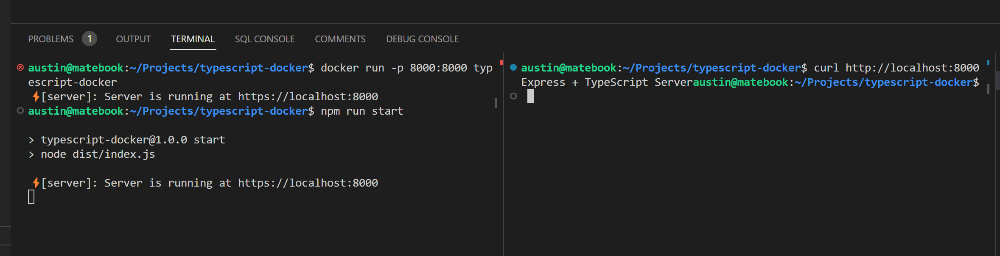
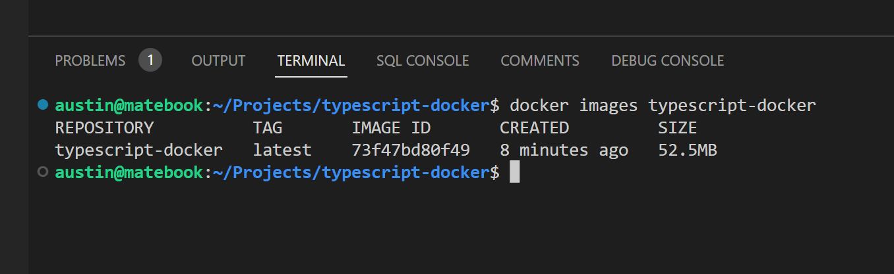

# typescript-docker optimized build

A Typescript App optimized for docker build size

## Getting Started on WSL2

start docker: `sudo service docker start`

build image: ` docker build -t typescript-docker-buildsize .`

docker list images: `docker images`

docker list active containers: `docker container ls`

run image: `docker run -p 8000:8000 typescript-docker-buildsize`

## Build Size

